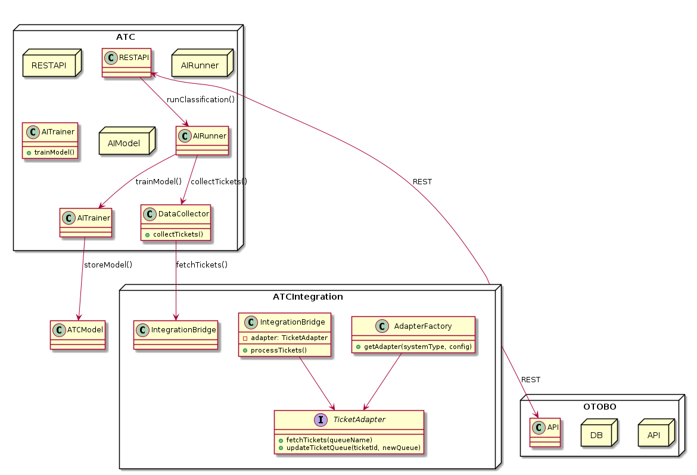

# Architekturübersicht

Open Ticket AI läuft als Hintergrunddienst, der von der Kommandozeile aus gestartet wird. Seine Architektur basiert auf einer modularen Pipeline, die jedes Ticket durch eine Reihe klar definierter Stufen verarbeitet. Dependency Injection und eine zentrale Konfigurationsdatei (`config.yml`) steuern, welche Komponenten verwendet werden, was es einfach macht, einzelne Teile zu erweitern oder zu ersetzen.

## Einstiegspunkt der Anwendung

Starten Sie die Anwendung mit:

```bash
python -m open_ticket_ai.src.ce.main start
```

Dieser Befehl initialisiert den Dependency Injection Container, erstellt das `App`-Objekt und startet die Hauptverarbeitungsschleife.

## Ausführungsablauf

1. `main.py` konfiguriert das Logging und erstellt einen `DIContainer`.
2. Der Container lädt `config.yml` und erstellt alle konfigurierten Komponenten.
3. Die `App` validiert die Konfiguration und delegiert an den `Orchestrator`.
4. Der `Orchestrator` liest die Pipeline-Definitionen und plant sie mithilfe der `schedule`-Bibliothek.
5. Jede geplante Pipeline fragt das Helpdesk-System periodisch nach neuen Tickets ab und verarbeitet diese.

## Verarbeitungspipeline

Die Ticket-Verarbeitungspipeline sieht wie folgt aus:

```mermaid
flowchart TB
    Start([Start])
    Sched[Scheduler löst **Orchestrator** für eine Pipeline aus]
    Start --> Sched

    subgraph "Pipeline-Ausführung"
        direction TB

        BF[Erste Pipe (**BasicTicketFetcher**) wird aufgerufen]
        Sched --> BF

        subgraph "TicketSystemAdapter"
            direction TB
            Fetch[Aufruf der fetch()-Methode<br/>Kommuniziert mit der REST-API des externen Ticketsystems]
        end
        BF --> Fetch

        Fetch --> Decision{Ticketdaten zurückgegeben?}

        Decision -- Ja --> Context[**PipelineContext** erstellen und füllen<br/>(enthält ticket_id, Daten)]
        Context --> SB[Kontext an **SubjectBodyPreparer** übergeben<br/>Daten werden für die KI transformiert]
        SB --> AI[Kontext an **HFAIInferenceService** übergeben<br/>KI-Vorhersage wird zum Kontext hinzugefügt]
        AI --> SF[Kontext an **SetFieldFromModelOutput** übergeben<br/>Vorhersage wird in eine Anweisung zur Feldaktualisierung umgewandelt (z.B. `{'Queue': 'Sales'}`)]
        SF --> GT[Kontext an die letzte Pipe (**GenericTicketUpdater**) übergeben]

        subgraph "TicketSystemAdapter"
            direction TB
            Update[Aufruf von update() mit Daten aus dem Kontext<br/>Kommuniziert mit der REST-API des externen Ticketsystems]
        end
        GT --> Update

        Update --> Complete[Pipeline für dieses Ticket ist abgeschlossen]
        Decision -- Nein --> EndNo[Pipeline endet]
    end

    Complete --> Stop([Stop])
    EndNo --> Stop

```

Jeder Schritt konsumiert und produziert **Value Objects** wie `subject`, `body`, `queue_id` und `priority`. Dieser Ansatz hält die Pipeline modular und ermöglicht das Hinzufügen neuer Schritte oder Value Objects mit minimalen Änderungen am restlichen System.

## Hauptkomponenten

- **App & Orchestrator** – Validieren die Konfiguration, planen Jobs und verwalten die gesamte Schleife.
- **Fetchers** – Rufen neue Tickets von externen Systemen ab.
- **Preparers** – Wandeln rohe Ticketdaten in eine für KI-Modelle geeignete Form um.
- **AI Inference Services** – Laden Hugging-Face-Modelle und erzeugen Vorhersagen für Queue oder Priorität.
- **Modifiers** – Übertragen die Vorhersagen über Adapter zurück an das Ticketsystem.
- **Ticket System Adapters** – Stellen REST-Integrationen mit Systemen wie OTOBO bereit.

Alle Komponenten werden in einem zentralen Dependency Injection Container registriert und über `config.yml` konfiguriert.

## Diagramme

### Anwendungsklassendiagramm


### Übersichtsdiagramm


Diese Diagramme veranschaulichen, wie die Pipeline orchestriert wird und wie die einzelnen Komponenten miteinander interagieren.

---