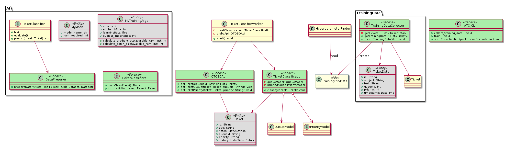

# Architekturübersicht

Open Ticket AI basiert auf einer modularen Pipeline, die jedes Ticket in einer Reihe von klar
definierten Stufen verarbeitet. Das System nutzt Dependency Injection und Konfigurationsdateien, um
diese Stufen zusammenzusetzen, was die Erweiterung oder den Austausch einzelner Teile erleichtert.

## Verarbeitungs-Pipeline

Die Pipeline zur Ticketverarbeitung sieht wie folgt aus:

```
[ Eingehendes Ticket ]
       ↓
[ Preprocessor ] — bereinigt & führt Betreff+Text zusammen
       ↓
[ Transformer Tokenizer ]
       ↓
[ Queue Classifier ] → Queue-ID + Konfidenz
       ↓
[ Priority Classifier ] → Prioritätswert + Konfidenz
       ↓
[ Postprocessor ] — wendet Schwellenwerte an, leitet weiter oder markiert
       ↓
[ Ticket System Adapter ] — aktualisiert Ticket über REST API
```

Jeder Schritt konsumiert und produziert **Werteobjekte** (Value Objects) wie `subject`, `body`,
`queue_id` und `priority`. Dieser Ansatz hält die Pipeline modular und ermöglicht das Hinzufügen
neuer Schritte oder Werteobjekte mit minimalen Änderungen am restlichen System.

## Hauptkomponenten

- **App & Orchestrator** – Validieren die Konfiguration, planen Jobs und verwalten die
  Gesamtschleife.
- **Fetchers** – Rufen neue Tickets von externen Systemen ab.
- **Preparers** – Wandeln rohe Ticketdaten in eine für KI-Modelle geeignete Form um.
- **AI Inference Services** – Laden Hugging Face-Modelle und erzeugen Vorhersagen für Queue oder
  Priorität.
- **Modifiers** – Übertragen die Vorhersagen über Adapter zurück in das Ticketsystem.
- **Ticket System Adapters** – Stellen REST-Integrationen mit Systemen wie OTOBO bereit.

Alle Komponenten werden in einem zentralen Dependency-Injection-Container registriert und über
`config.yml` konfiguriert.

## Diagramme

### Anwendungs-Klassendiagramm



### Übersichtsdiagramm


Diese Diagramme veranschaulichen, wie die Pipeline orchestriert wird und wie die einzelnen
Komponenten miteinander interagieren.
