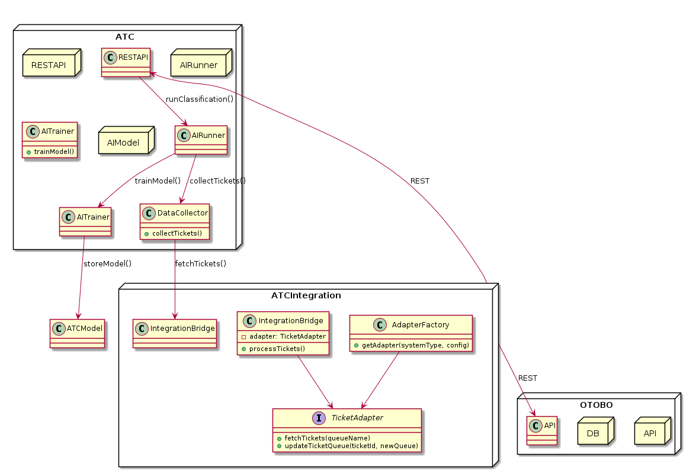

# Architecture Overview

Open Ticket AI runs as a background service that is started from the command
line.  Its architecture is built around a modular pipeline that processes each
ticket through a series of well‑defined stages.  Dependency injection and a
central configuration file (`config.yml`) control which components are used,
making it easy to extend or replace individual pieces.

## Application Entry Point

Start the application with:

```bash
python -m open_ticket_ai.src.ce.main start
```

This command initializes the dependency injection container, constructs the
`App` object and begins the main processing loop.

## Execution Flow

1. `main.py` configures logging and builds a `DIContainer`.
2. The container loads `config.yml`, creating all configured components.
3. The `App` validates the configuration and delegates to the
   `Orchestrator`.
4. The `Orchestrator` reads the pipeline definitions and schedules them using
   the `schedule` library.
5. Each scheduled pipeline periodically polls the help desk for new tickets and
   processes them.

## Processing Pipeline

The ticket processing pipeline looks like this:

```mermaid
flowchart TB
    Start([Start])
    Sched[Scheduler triggers **Orchestrator** for a Pipeline]
    Start --> Sched

    subgraph "Pipeline Execution"
        direction TB

        BF[First Pipe (**BasicTicketFetcher**) is called]
        Sched --> BF

        subgraph "TicketSystemAdapter"
            direction TB
            Fetch[Call `fetch()` method<br/>Communicates with External Ticket System REST API]
        end
        BF --> Fetch

        Fetch --> Decision{Ticket data returned?}

        Decision -- Yes --> Context[Create and populate **PipelineContext**<br/>(contains ticket_id, data)]
        Context --> SB[Pass context to **SubjectBodyPreparer**<br/>Data is transformed for AI]
        SB --> AI[Pass context to **HFAIInferenceService**<br/>AI prediction is added to context]
        AI --> SF[Pass context to **SetFieldFromModelOutput**<br/>Prediction is converted to a field update instruction (e.g., `{'Queue': 'Sales'}`)]
        SF --> GT[Pass context to last pipe (**GenericTicketUpdater**)]

        subgraph "TicketSystemAdapter"
            direction TB
            Update[Call `update()` with data from context<br/>Communicates with External Ticket System REST API]
        end
        GT --> Update

        Update --> Complete[Pipeline for this ticket is complete]
        Decision -- No --> EndNo[Pipeline ends]
    end

    Complete --> Stop([Stop])
    EndNo --> Stop

```

Each step consumes and produces **Value Objects** such as `subject`, `body`, `queue_id` and `priority`. This approach keeps the pipeline modular and allows new steps or value objects to be added with minimal changes to the rest of the system.

## Main Components

- **App & Orchestrator** – Validate configuration, schedule jobs and manage the overall loop.
- **Fetchers** – Retrieve new tickets from external systems.
- **Preparers** – Transform raw ticket data into a form suitable for AI models.
- **AI Inference Services** – Load Hugging Face models and produce queue or priority predictions.
- **Modifiers** – Apply the predictions back to the ticket system via adapters.
- **Ticket System Adapters** – Provide REST integrations with systems such as OTOBO.

All components are registered in a central dependency injection container and configured via `config.yml`.

## Diagrams

### Application Class Diagram


### Overview Diagram


These diagrams illustrate how the pipeline is orchestrated and how each component interacts with the others.

---
