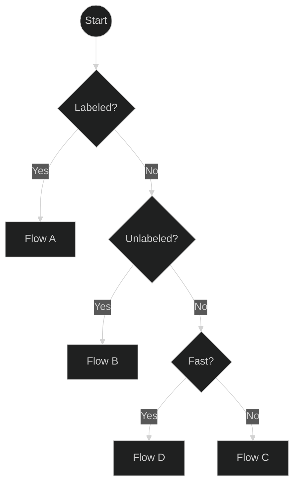
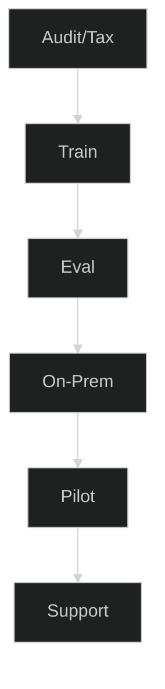
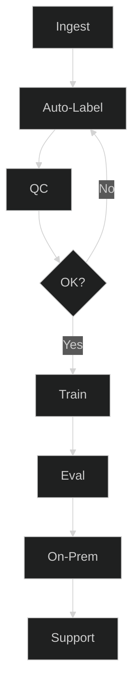
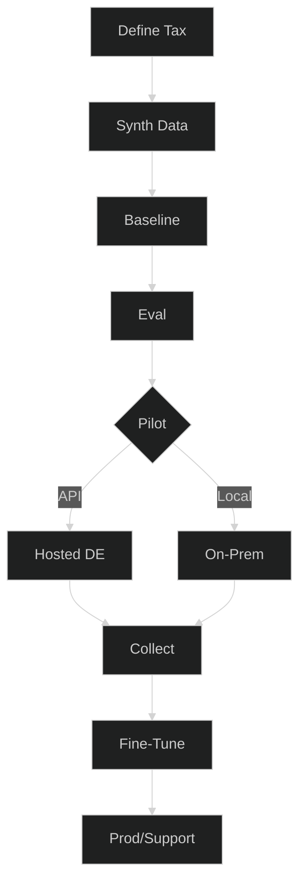
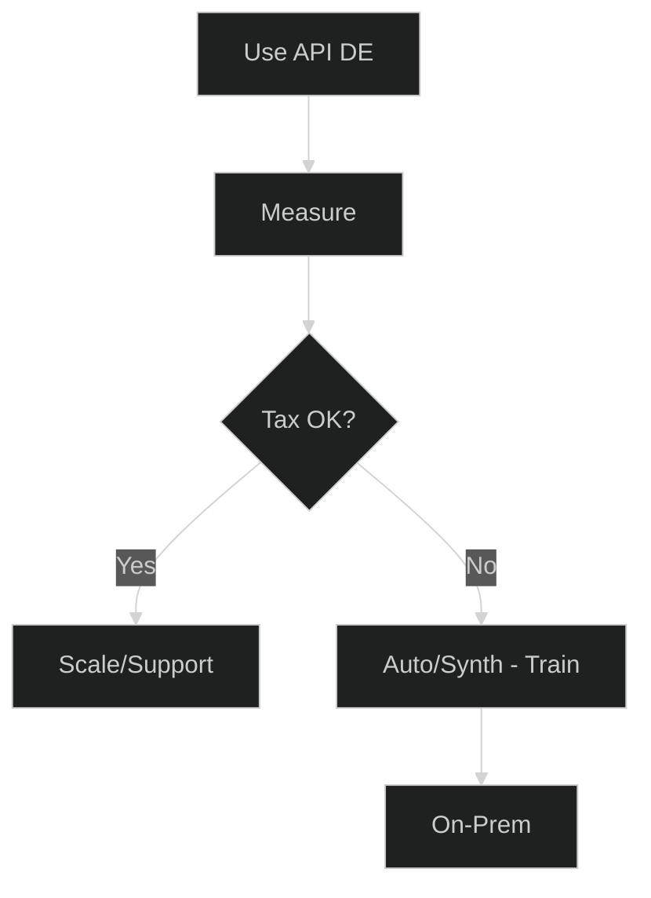
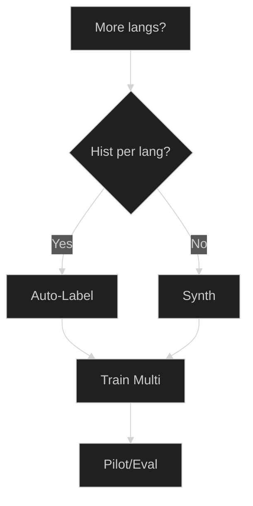
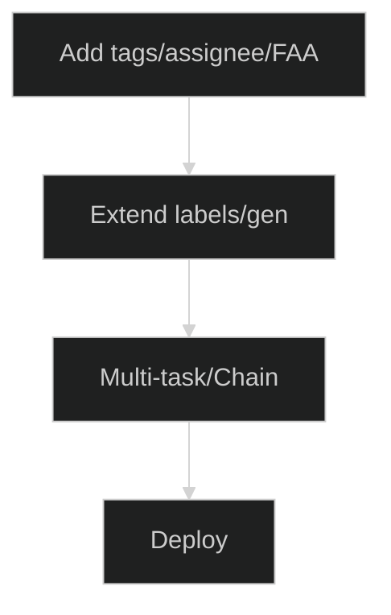

# Ticket Automation Planner (Flows)

Not every team starts from the same place. Pick the flow that matches your situation.
Each diagram links to the relevant part of the docs and ends in a clear **service package**.
## 0) One-screen overview

---

##  A) Many labeled

---

##  B) Many unlabeled

---

##  C) Few / no tickets

---

##  D) Quick start (API)

---

## Optional add-ons

### Multilingual

### Extra attributes

