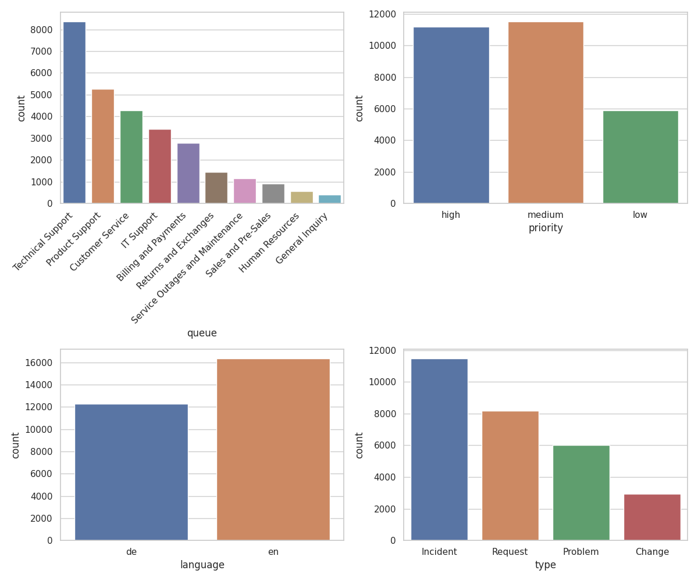

# Multilingual Customer Support Tickets (Synthetic)

A **fully synthetic** dataset for training and evaluating help-desk models such as **queue**, **priority**, and **type**
classification, plus response-assist pretraining.
Created with our Python **Synthetic Data Generator** and published on **Kaggle**.

* **Kaggle:
  ** [https://www.kaggle.com/datasets/tobiasbueck/multilingual-customer-support-tickets/data](https://www.kaggle.com/datasets/tobiasbueck/multilingual-customer-support-tickets/data)
* **Generator:** [/synthetic-data/synthetic-data-generation.md](/synthetic-data/synthetic-data-generation.md) (planned *
  *LGPL**)
* **Need custom data or the tool?** [sales@softoft.de](mailto:sales@softoft.de)

---

## Versions at a glance


| Version | Languages                     | Size (relative) | Notes                                                                 |
|--------:|-------------------------------|-----------------|-----------------------------------------------------------------------|
|  **v5** | **EN, DE**                    | Largest         | Latest and most refined taxonomy/balancing; focuses on EN/DE quality. |
|  **v4** | **EN, DE**                    | Large           | Similar to v5 focus; slightly older prompts and distributions.        |
|  **v3** | EN, DE, **+ more (FR/ES/PT)** | Smaller         | Earlier pipeline; more languages but less diverse content overall.    |

> Older versions include **more languages** but are generally **smaller** and **less diverse**.
> Newest versions (**v5**, **v4**) emphasize **EN/DE** quality and scale.

### Which version should I use?

* **Training EN/DE production models** → start with **v5** (or **v4** if you need a comparable older set).
* **Research across multiple languages** → **v3** (smaller, but includes more locales).

---

## Files & naming

You’ll find CSV exports per version (examples):

```
dataset-tickets-multi-lang-4-20k.csv
dataset-tickets-multi-lang3-4k.csv
dataset-tickets-german_normalized.csv
```

---

## Schema

Every ticket includes core text plus labels used by **Open Ticket AI**.

| Column              | Description                                        |
|---------------------|----------------------------------------------------|
| `subject`           | The customer’s email subject                       |
| `body`              | The customer’s email body                          |
| `answer`            | The agent’s first answer (AI-generated)            |
| `type`              | Ticket type (e.g., Incident, Request, Problem, …)  |
| `queue`             | Target queue (e.g., Technical Support, Billing)    |
| `priority`          | Priority (e.g., low, medium, high)                 |
| `language`          | Ticket language (e.g., `en`, `de`, …)              |
| `version`           | Dataset version (metadata)                         |
| `tag_1`, `tag_2`, … | One or more topical tags (may be `null` in places) |

### Snippets from the data

* **de (Incident / Technical Support / high)**
  *Subject:* Wesentlicher Sicherheitsvorfall
  *Body (excerpt):* „…ich möchte einen gravierenden Sicherheitsvorfall melden…“
  *Answer (excerpt):* „Vielen Dank für die Meldung…“

* **en (Incident / Technical Support / high)**
  *Subject:* Account Disruption
  *Body (excerpt):* “I am writing to report a significant problem with the centralized account…”
  *Answer (excerpt):* “We are aware of the outage…”

* **en (Request / Returns and Exchanges / medium)**
  *Subject:* Query About Smart Home System Integration Features
  *Body (excerpt):* “I am reaching out to request details about…”
  *Answer (excerpt):* “Our products support…”

---

## Visual tour




---

## Intended use & limitations

**Intended:**

* Cold-start model training for **queue/priority/type**
* Class balancing experiments
* Multilingual benchmarking (use **v3** if you need FR/ES/PT)

**Limitations:**

* Synthetic distributions may differ from your production traffic. Always validate on a small, anonymized real sample
  before deployment.

---

## How to load & quick checks

```python
import pandas as pd

df = pd.read_csv("dataset-tickets-multi-lang-4-20k.csv")  # or your chosen version

# Basic sanity checks
print(df.language.value_counts())
print(df.queue.value_counts().head())

# Prepare simple text for classification
X = (df["subject"].fillna("") + "\n\n" + df["body"].fillna("")).astype(str)
y = df["queue"].astype(str)
```

---

## Relationship to Open Ticket AI

This dataset mirrors the labels **Open Ticket AI** predicts on inbound tickets (**queue**, **priority**, **type**, *
*tags**).
Use it to **bootstrap** training and evaluation; deploy your model with **Open Ticket AI** once you’re happy with
metrics.

* **Synthetic Data Generator:
  ** [/synthetic-data/synthetic-data-generation.md](synthetic-data-generation.md)
* **Prediction API (hosted):** [/prediction-api/](../prediction-api/)

---

## License & citation

* Dataset: please add your chosen data license here (e.g., **CC BY 4.0**).
* Generator: planned **LGPL**. For access or customizations: **[sales@softoft.de](mailto:sales@softoft.de)**.

**Suggested citation:**

> Bueck, T. (2025). *Multilingual Customer Support Tickets (Synthetic)*. Kaggle Dataset.
> Generated with the Open Ticket AI Synthetic Data Generator.

---

## Changelog (high level)

* **v5:** EN/DE only; largest set; improved taxonomy and balancing.
* **v4:** EN/DE; large; earlier prompt set.
* **v3:** Smaller; includes additional languages (FR/ES/PT), earlier pipeline.
